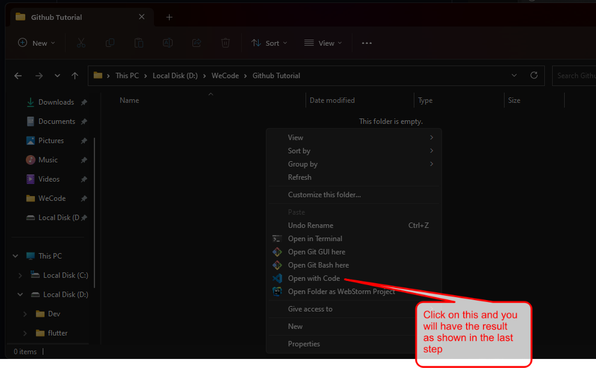
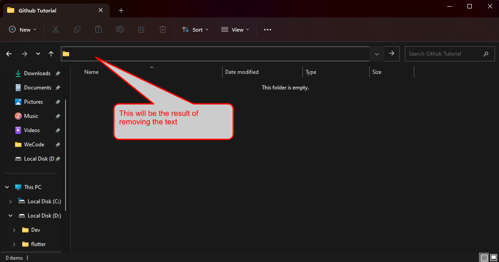
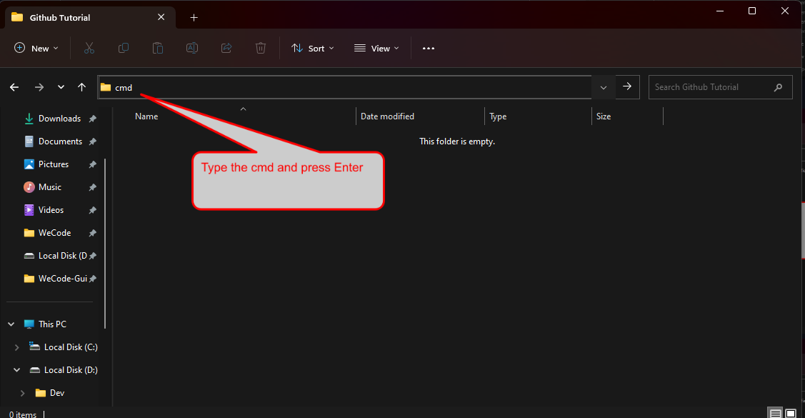
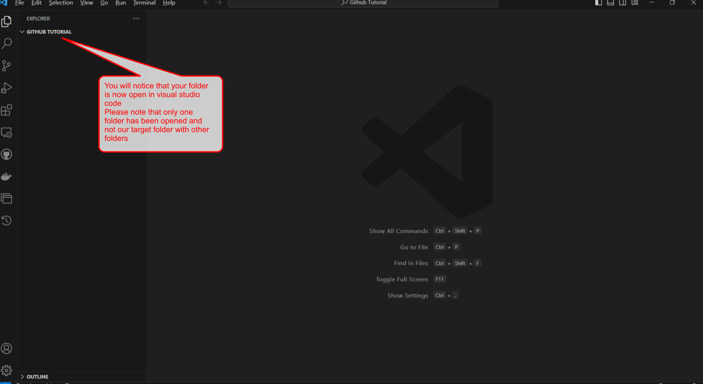
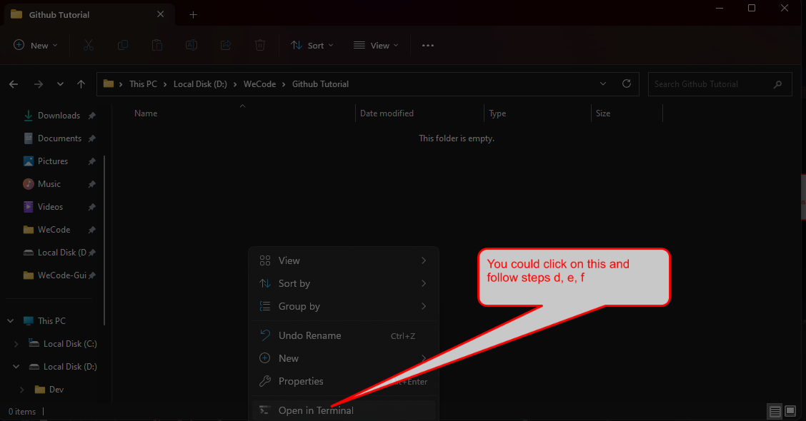

# A Guide To Creating A New Repository Locally On Your Machine/Laptop

- #### For Starters All work with regard to WeCode should be in a 📂 folder named WeCode

- #### From this folder all other WeCode projects will be created in this 📂 folder

                📂WeCode
                   |__📂Flex
                   |__📂Result Summary Component
                   |__📂Another Project

- #### To start a project create a folder and name it as required, for this case I will use 📂Github Tutorial so assuming that you just have one folder in your 📂WeCode folder your structure would look like:

              📂WeCode
              |__📂Github Tutorial

- #### Then proceed to enter into the folder and you will have such a view:

- #### The next step is to open the folder in Visual Studio Code, this has various approaches:
  1. [x] Directly opening the folder with code
    
  
  2. [x] Using cmd command to open the terminal and typing code
            
     1. [✅]
       
     2. [✅]
       
     3. [✅]
       
     4. [✅]
       
     5. [✅]
       
     6. [✅]
       
     
  3. [x] Using the shortcut to open the terminal and type code
     

- #### Before writing code always initialize the repository
    - To do this you need to:
      - Open your terminal and click on __New Terminal__
        
        - This will trigger your terminal to open and by default it will be a PowerShell terminal (this is for those who did not configure a default profile)
      - Configure a default profile so that **_git bash_** is your default terminal in Vs Code