# A Guide To Creating A New Repository Locally On Your Machine/Laptop

- #### For Starters All work with regard to WeCode should be in a 📂 folder named WeCode

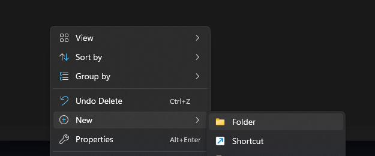

- #### From this folder all other WeCode projects will be created in this 📂 folder

                📂WeCode
                   |__📂Flex
                   |__📂Result Summary Component
                   |__📂Another Project

- #### To start a project create a folder and name it as required, for this case I will use 📂Github Tutorial so assuming that you just have one folder in your 📂WeCode folder your structure would look like:

              📂WeCode
              |__📂Github Tutorial

- #### Then proceed to enter into the folder and you will have such a view:

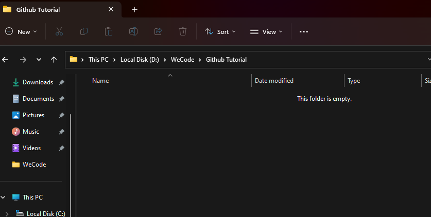

- #### The next step is to open the folder in Visual Studio Code, this has various approaches:
    1. [x] Directly opening the folder with code
       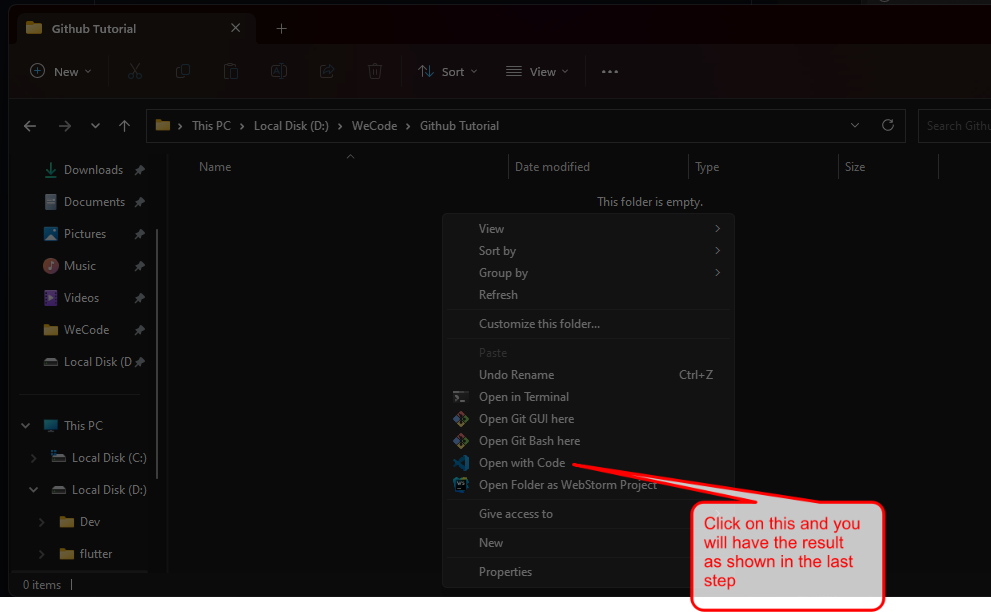

    2. [x] Using cmd command to open the terminal and typing code

        1. [✅]
           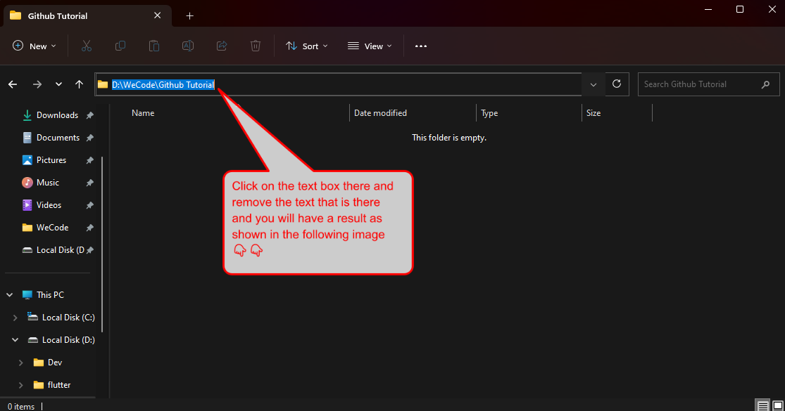
        2. [✅]
           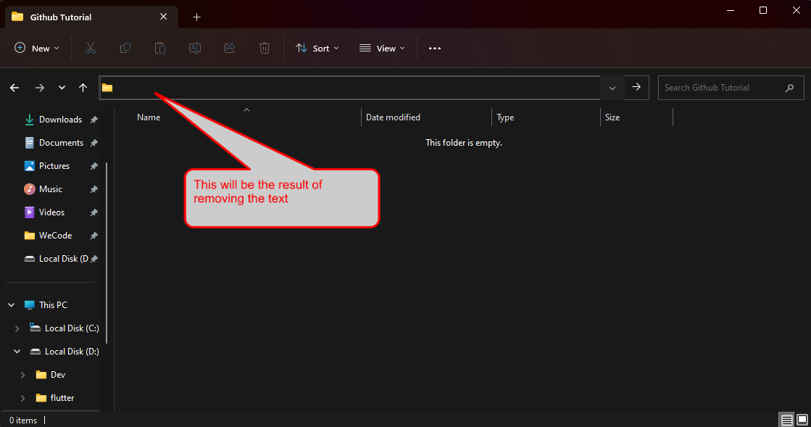
        3. [✅]
           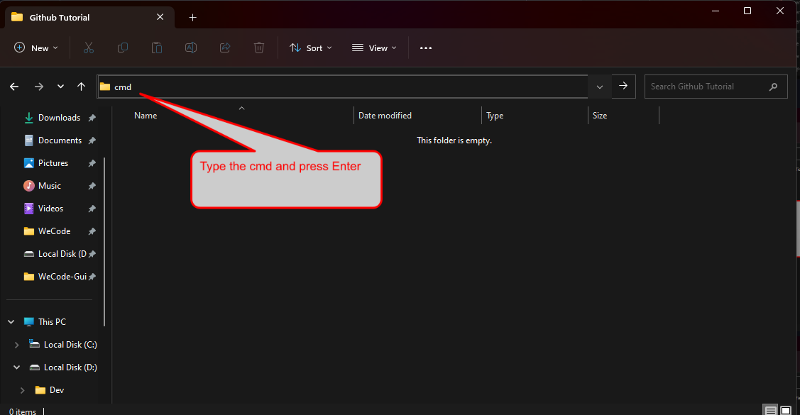
        4. [✅]
           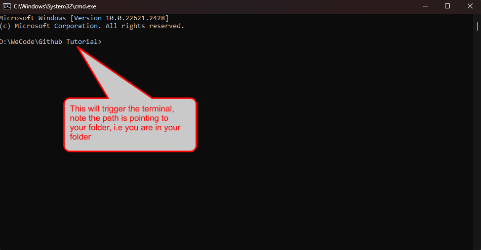
        5. [✅]
           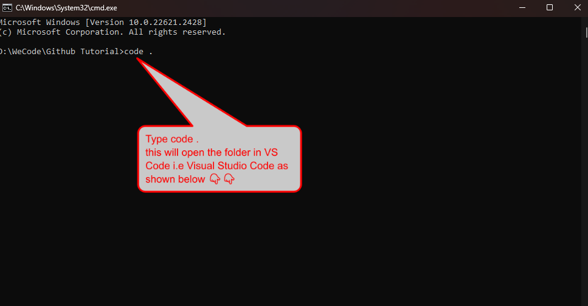
        6. [✅]
           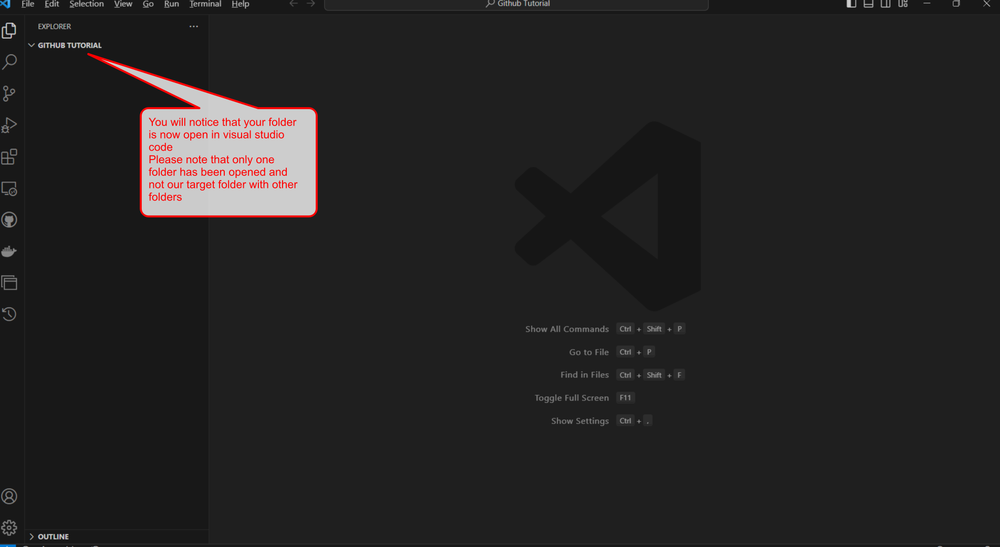

    3. [x] Using the shortcut to open the terminal and type code
       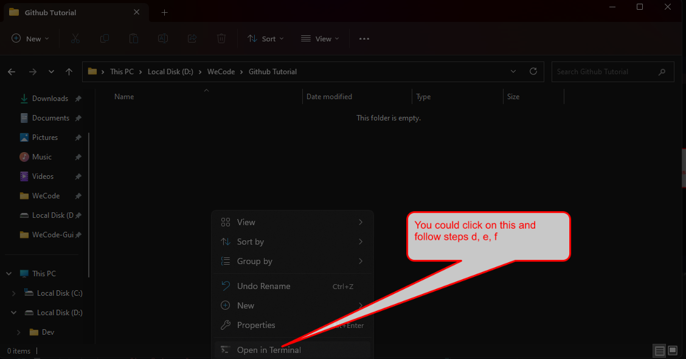

- #### Before writing code always initialize the repository
    - To do this you need to:
        - Ensure you have Git Bash installed if not follow the steps here:
            - Click on your windows icon and type __bash__
            - If it does not exist:
                - [Download it here and install it](https://git-scm.com/download/win)
                - Open your terminal and do the following
                  ```shell
                    #setup your global username
                    git config --global user.name "Your Github Name i.e Ian John Doe"
                    #set up your global email
                    git config --global user.email "Your Github Email i.e ianjohndoe@gmail.com"```
                - Confirm that the globals have been correctly setup
           ```shell
            #this should output the name that we put above i.e Ian John Doe
            git config --global user.name 
          
            #this should output the email that we put above i.e ianjohndoe@gmail.com
            git config --global user.email 
          ```
          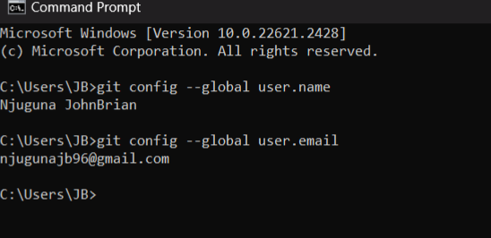

            - If it exists:
                - Confirm that you have the globals set up as above by running the commands in the above image, if no
                  follow the above steps and set up your globals

        - Open your terminal and click on __New Terminal__
          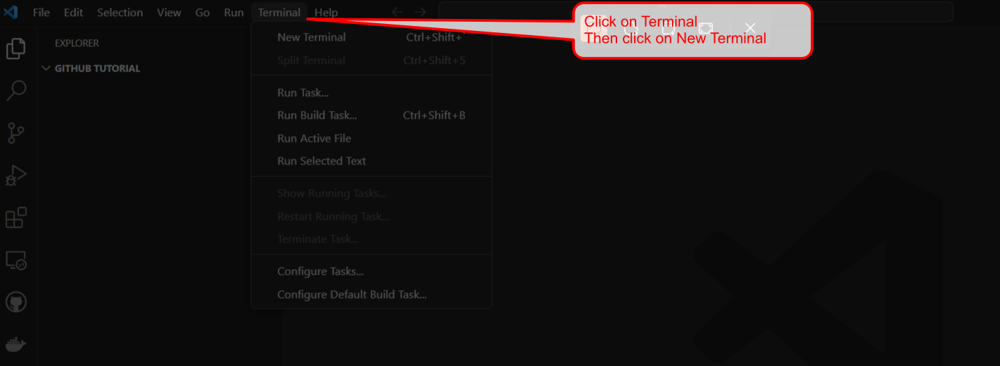
            - This will trigger your terminal to open and by default it will be a PowerShell terminal (this is for those
              who did not configure a default profile)
        - Configure a default profile so that **_git bash_** is your default terminal in Vs Code
          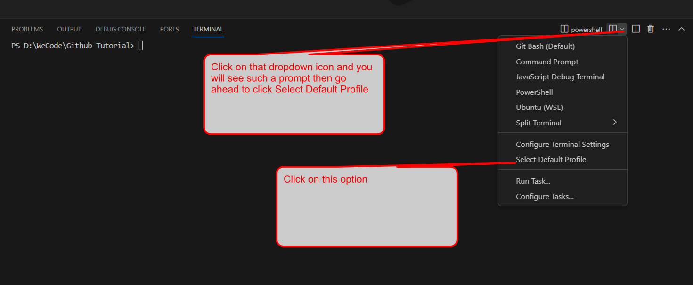
        - Go ahead and select __Git Bash__ as your default profile and click on the __🗑️__ icon as shown in the image
          below
          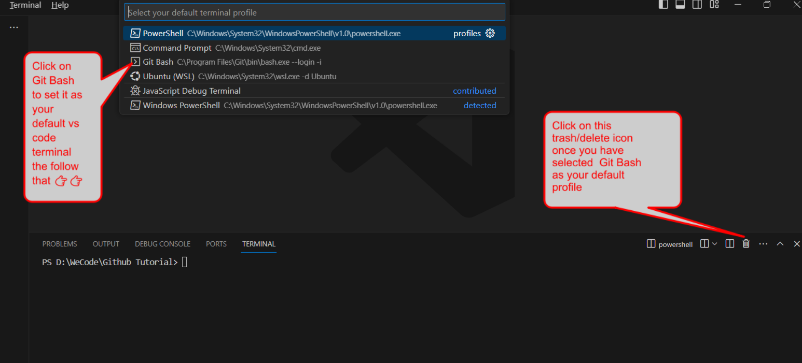
        - Go ahead and click on __Terminal__ as shown above and the __New Terminal__  and you should have something
          like:
          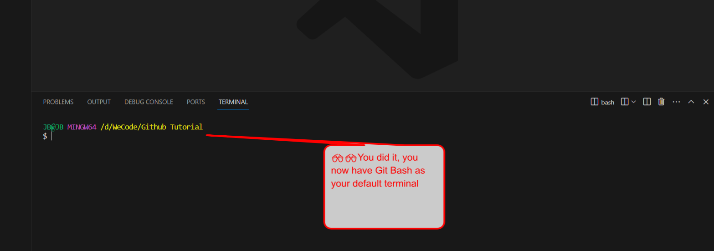
        - Go ahead and initialize the respository as you were shown by Hopp 


## ASSIGNMENT

[Watch this video and complete everything in it, proof of completion will be required by Sunday Evening](https://youtu.be/CvUiKWv2-C0?si=htRr7Ov8I0X8J21e)
- Please note that you will take turns presenting and explaining some few concepts
- Try to take notes and document the commands 